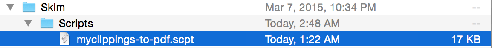
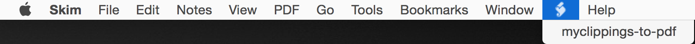

# myclippings-to-pdf

## About
Applescript to add highlights and notes to a pdf from a kindle "My Clippings.txt" file using Skim.

**NOTE: This will only work on OS X.**

## Install
First download and install [Skim](http://skim-app.sourceforge.net)

Now download myclippings-to-pdf.scpt by either cloning this project
    
    git clone git@github.com:carlosrojas/myclippings-to-pdf.git

or simply right click on the .scpt file above and hit "Download Linked File",
which should  place the file in your Download folder.

Next you will need to go to open Finder and hit command + shift + G then paste
"/Library/Application Support/" into the text box. Once in the directory create
a Skim folder if it's not already there. Then create a subfolder under Skim
called "Scripts". Lastly, place the filed you downloaded into the folder as
shown below.

    
When you open up Skim you should see the following icon and script name

You should now be able to open up your PDF in skim an import your highlights. I
am assuming that you have "My Clippings.txt" somewhere on your computer and
that the filename of the PDF matches what it was called when it was on your
kindle.

##Contribute
Please don't be afraid to open up an issue or shoot me a tweet/email. I am sure
there's lots of things that can be improved.

After that just fire up a pull-request.

##Help

Email me, Carlos Rojas at <carlos@atrojas.com>

Tweet me, [@_atrojas](https://twitter.com/_atrojas)

## License
myclippings-to-pdf is released under the MIT License.
